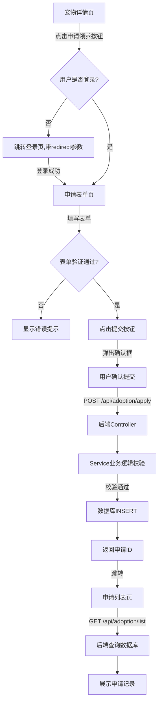
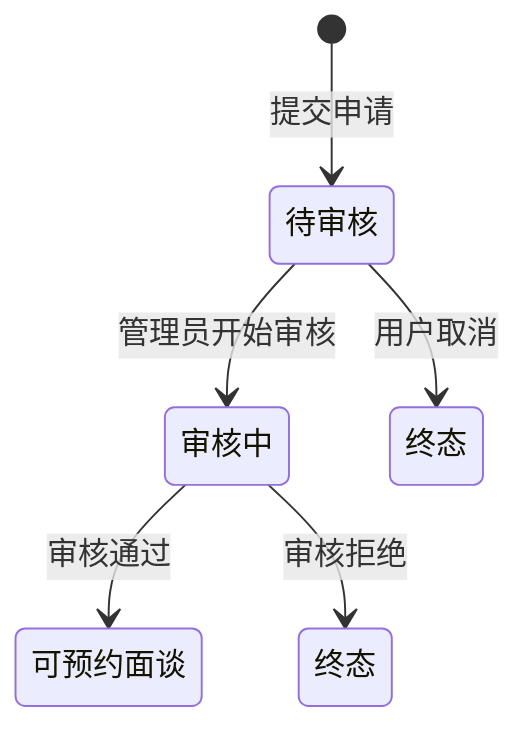

# 宠物领养申请流程说明

## 一、流程总览

用户从宠物详情页点击申请按钮，到填写表单提交，最后在申请列表看到记录，整个流程涉及前端页面交互、后端API处理、数据库操作三个层面。



---

## 二、状态流转说明

### 2.1 申请状态定义

| 状态值 | 状态文本 | 说明 | 可操作 |
|--------|----------|------|--------|
| 0 | 待审核 | 申请刚提交，等待审核 | 可取消 |
| 1 | 审核中 | 管理员正在审核 | 不可操作 |
| 2 | 已通过 | 审核通过 | 可预约面谈 |
| 3 | 已拒绝 | 审核被拒绝 | 不可操作 |
| 4 | 已取消 | 用户主动取消 | 不可操作 |

### 2.2 状态流转图



---

## 三、分步详细说明

### 步骤1：宠物详情页 - 点击申请

**前端文件**：`frontend/src/views/PetDetail.vue:109-131`

```javascript
// 申请按钮显示逻辑
if (pet.status === 1) {  // 宠物状态为"可领养"时才显示按钮
  if (isLoggedIn) {
    // 已登录：直接跳转到申请表单
    <router-link :to="`/apply/${pet.id}`">申请领养</router-link>
  } else {
    // 未登录：跳转到登录页，携带redirect参数
    <router-link :to="{ name: 'Login', query: { redirect: `/apply/${pet.id}` } }">
      登录后申请领养
    </router-link>
  }
}
```

**关键检查点**：
- 宠物状态必须为 `1`（可领养）
- 判断用户登录状态（通过 `userStore.isLoggedIn`）

---

### 步骤2：申请表单页 - 填写并提交

**前端文件**：`frontend/src/views/Apply.vue`

#### 2.1 表单字段

| 字段 | 类型 | 校验规则 |
|------|------|----------|
| 居住类型 | 单选 | 必填（独居/家人同住/合租） |
| 住房情况 | 单选 | 必填（自有房产/租房） |
| 是否有院子 | 单选 | 必填（是/否） |
| 养宠经验 | 下拉 | 必填（无经验/1-3年/3年以上） |
| 每日陪伴时间 | 下拉 | 必填（少于2小时/2-5小时/5小时以上） |
| 家中现有宠物 | 多选 | 可选（猫/狗/其他/无） |
| 领养理由 | 文本域 | 50-500字 |
| 详细地址 | 文本 | 至少5个字符 |

#### 2.2 表单提交逻辑

```javascript
// frontend/src/views/Apply.vue:270-298
const handleSubmit = async () => {
  try {
    const res = await adoptionApi.apply({
      petId: parseInt(petId),
      livingType: form.livingType,
      housingType: form.housingType,
      hasYard: form.hasYard ? 1 : 0,  // 布尔转数字
      experience: form.experience,
      dailyTime: form.dailyTime,
      currentPets: form.currentPets,  // 数组
      reason: form.reason,
      contactAddress: form.contactAddress
    })

    if (res.code === 200) {
      toast.success('申请提交成功！')
      router.push('/user/applications')  // 跳转到申请列表
    }
  } catch (e) {
    errorMessage.value = '网络错误，请稍后重试'
  }
}
```

---

### 步骤3：后端Controller层 - 接收请求

**后端文件**：`backend/src/main/java/com/petadoption/controller/AdoptionController.java:26-34`

```java
@PostMapping("/apply")
public Result<Map<String, Long>> apply(@RequestBody AdoptionApplyDTO dto) {
    // 从JWT Token中获取当前登录用户ID
    Long userId = UserContext.getUserId();
    
    // 调用Service层处理业务逻辑
    Long applicationId = adoptionService.apply(userId, dto);

    // 返回申请ID
    Map<String, Long> result = new HashMap<>();
    result.put("applicationId", applicationId);
    return Result.success("申请提交成功", result);
}
```

**关键技术点**：
- `UserContext.getUserId()` 从拦截器解析的JWT中获取用户ID
- 使用 `@RequestBody` 接收JSON格式的请求体
- 返回统一格式的 `Result` 对象

---

### 步骤4：后端Service层 - 业务逻辑校验

**后端文件**：`backend/src/main/java/com/petadoption/service/impl/AdoptionServiceImpl.java:30-90`

#### 4.1 业务校验顺序

```java
@Override
@Transactional  // 事务注解，保证数据一致性
public Long apply(Long userId, AdoptionApplyDTO dto) {
    // 1. 校验宠物是否存在且可领养
    Pet pet = petMapper.selectById(dto.getPetId());
    if (pet == null) {
        throw BusinessException.notFound("宠物不存在");
    }
    if (pet.getStatus() != 1) {
        throw BusinessException.badRequest("该宠物已被领养或下架");
    }

    // 2. 检查是否已有进行中的申请（防止重复申请）
    if (adoptionMapper.existsByUserIdAndPetId(userId, dto.getPetId())) {
        throw BusinessException.conflict("您已提交过该宠物的领养申请");
    }

    // 3. 校验所有必填字段
    // ... 字段校验逻辑 ...

    // 4. 创建申请实体
    AdoptionApplication application = new AdoptionApplication();
    application.setUserId(userId);
    application.setPetId(dto.getPetId());
    // ... 设置其他字段 ...
    application.setStatus(0);  // 初始状态：待审核

    // 5. 处理数组转字符串
    if (dto.getCurrentPets() != null && !dto.getCurrentPets().isEmpty()) {
        application.setCurrentPets(String.join(",", dto.getCurrentPets()));
    }

    // 6. 插入数据库
    adoptionMapper.insert(application);

    return application.getId();
}
```

#### 4.2 防重复申请SQL

**文件**：`backend/src/main/resources/mapper/AdoptionMapper.xml:57-60`

```xml
<select id="existsByUserIdAndPetId" resultType="boolean">
    SELECT COUNT(1) > 0 FROM adoption_application
    WHERE user_id = #{userId} AND pet_id = #{petId} 
    AND status IN (0, 1, 2)  <!-- 只有这三种状态算进行中 -->
</select>
```

---

### 步骤5：数据库操作 - 插入记录

**数据库表**：`adoption_application`

#### 5.1 表结构

| 字段名 | 类型 | 说明 |
|--------|------|------|
| id | BIGINT | 主键，自增 |
| user_id | BIGINT | 用户ID，外键 |
| pet_id | BIGINT | 宠物ID，外键 |
| living_type | VARCHAR | 居住类型 |
| housing_type | VARCHAR | 住房类型 |
| has_yard | TINYINT | 是否有院子（1是0否） |
| experience | VARCHAR | 养宠经验 |
| current_pets | VARCHAR | 现有宠物（逗号分隔） |
| daily_time | VARCHAR | 每日陪伴时间 |
| reason | TEXT | 领养理由 |
| contact_address | VARCHAR | 联系地址 |
| status | TINYINT | 状态（默认0） |
| remark | TEXT | 审核备注 |
| create_time | DATETIME | 创建时间（自动） |
| update_time | DATETIME | 更新时间（自动） |

#### 5.2 插入SQL

```xml
<insert id="insert" parameterType="AdoptionApplication" useGeneratedKeys="true" keyProperty="id">
    INSERT INTO adoption_application (
        user_id, pet_id, living_type, housing_type, has_yard, 
        experience, current_pets, daily_time, reason, contact_address, 
        status, create_time, update_time
    ) VALUES (
        #{userId}, #{petId}, #{livingType}, #{housingType}, #{hasYard},
        #{experience}, #{currentPets}, #{dailyTime}, #{reason}, #{contactAddress},
        #{status}, NOW(), NOW()
    )
</insert>
```

---

### 步骤6：申请列表页 - 查询展示

**前端文件**：`frontend/src/views/user/Applications.vue`

#### 6.1 前端查询逻辑

```javascript
const loadApplications = async () => {
  const params = {
    page: currentPage.value,
    pageSize: 10
  }
  if (currentStatus.value) {
    params.status = parseInt(currentStatus.value)  // 可选的状态筛选
  }

  const res = await adoptionApi.getList(params)
  if (res.code === 200) {
    applications.value = res.data?.list || res.data || []
  }
}
```

#### 6.2 后端分页查询

```java
// AdoptionServiceImpl.java:92-129
public PageResult<AdoptionVO> getMyApplications(Long userId, Integer status, Integer page, Integer pageSize) {
    int offset = (page - 1) * pageSize;

    // 1. 分页查询申请记录
    List<AdoptionApplication> applications = 
        adoptionMapper.selectByUserId(userId, status, offset, pageSize);
    
    // 2. 查询总数
    long total = adoptionMapper.selectCountByUserId(userId, status);

    // 3. 关联查询宠物信息并转换VO
    List<AdoptionVO> voList = applications.stream().map(app -> {
        AdoptionVO vo = new AdoptionVO();
        vo.setId(app.getId());
        vo.setStatus(app.getStatus());
        vo.setStatusText(getStatusText(app.getStatus()));
        
        // 关联查询宠物信息
        Pet pet = petMapper.selectById(app.getPetId());
        if (pet != null) {
            vo.setPet(convertToPetVO(pet));
        }
        return vo;
    }).collect(Collectors.toList());

    return new PageResult<>(voList, total, page, pageSize);
}
```

---

## 四、数据流转全景图

### 4.1 请求链路

```
用户点击提交
    ↓
[前端] Apply.vue handleSubmit()
    ↓  POST /api/adoption/apply
[后端] AdoptionController.apply()
    ↓
[后端] AdoptionServiceImpl.apply()
    ├─→ 查询 pet 表（校验宠物状态）
    ├─→ 查询 adoption_application 表（防重复）
    └─→ INSERT adoption_application 表
    ↓
[前端] 跳转 /user/applications
    ↓  GET /api/adoption/list
[后端] AdoptionController.getMyApplications()
    ↓
[后端] AdoptionServiceImpl.getMyApplications()
    ├─→ SELECT adoption_application 分页
    └─→ 关联查询 pet 表获取宠物信息
    ↓
[前端] 渲染申请列表
```

### 4.2 关键数据对象

**DTO（数据传输对象）**：`AdoptionApplyDTO`
- 前端传向后端的表单数据
- 包含表单所有字段

**Entity（实体对象）**：`AdoptionApplication`
- 与数据库表一一对应
- 包含数据库所有字段

**VO（视图对象）**：`AdoptionVO` / `AdoptionDetailVO`
- 后端返回给前端的数据
- 包含关联的宠物信息
- 包含状态文本描述

---

## 五、异常处理

| 异常场景 | 前端提示 | 后端异常类型 |
|----------|----------|--------------|
| 宠物不存在 | 宠物不存在 | BusinessException.notFound |
| 宠物不可领养 | 该宠物已被领养或下架 | BusinessException.badRequest |
| 重复申请 | 您已提交过该宠物的领养申请 | BusinessException.conflict |
| 字段校验失败 | 对应字段提示 | BusinessException.badRequest |
| 用户未登录 | 跳转到登录页 | 拦截器返回401 |
| 网络错误 | 网络错误，请稍后重试 | - |

---

## 六、核心文件速查

| 层级 | 文件路径 | 说明 |
|------|----------|------|
| 前端页面 | `frontend/src/views/PetDetail.vue` | 宠物详情页（申请入口） |
| 前端页面 | `frontend/src/views/Apply.vue` | 申请表单页 |
| 前端页面 | `frontend/src/views/user/Applications.vue` | 申请列表页 |
| 前端API | `frontend/src/api/adoption.js` | 领养相关API封装 |
| 后端Controller | `backend/.../controller/AdoptionController.java` | API接口定义 |
| 后端Service | `backend/.../service/impl/AdoptionServiceImpl.java` | 业务逻辑实现 |
| 数据库SQL | `backend/src/main/resources/sql/schema.sql` | 表结构定义 |
| Mapper XML | `backend/src/main/resources/mapper/AdoptionMapper.xml` | SQL映射 |
